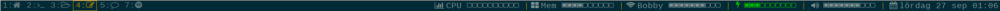

status-to-json
==========
This is an alternative to Conky that I wrote as an exercise in C++. Saves me a few CPU cycles compared to Conky and gives me more customizability.

## Compile & install
Note that this depends on Boost.

``` bash
$ git clone https://github.com/Edholm/status-to-json.git
```
Make the necessary changes in the header files. Wlan interface name etc.

```
$ cd status-to-json
$ make
$ cp bin/status-to-json ~/.i3
```

## How to use
In your i3 config, put this in the `bar` section:

```
status_command    $HOME/.i3/status-to-json
```

then restart i3: 
```bash
$ i3-msg restart
```

## Result:
This would result in something like this:

  
  
